# To Do App Flutter
Simple app to manage everyday tasks. Every task has a title, optional description, image, which is added automatically. Every todo can be edited and removed 

## Getting Started

For help getting started with Flutter, view online
[documentation](https://flutter.dev/).

#### 1. [Setup Flutter](https://flutter.dev/setup/)

#### 2. Clone the repo

```sh
$ git clone https://github.com/JadavChirag/To-Do-App-Flutter.git
$ cd Flutter-Pictures/
```

#### 4. Run the app

```sh
$ flutter run
```
## Screenshots
# iOS

|                                                                                                                             |                                                                                                                               |                                                                                                                                                                                                                                                                                                                                                                   |
|-----------------------------------------------------------------------------------------------------------------------------|-------------------------------------------------------------------------------------------------------------------------------|-------------------------------------------------------------------------------------------------------------------------------------------------------------------------------------------------------------------------------------------------------------------------------------------------------------------------------------------------------------------------
| 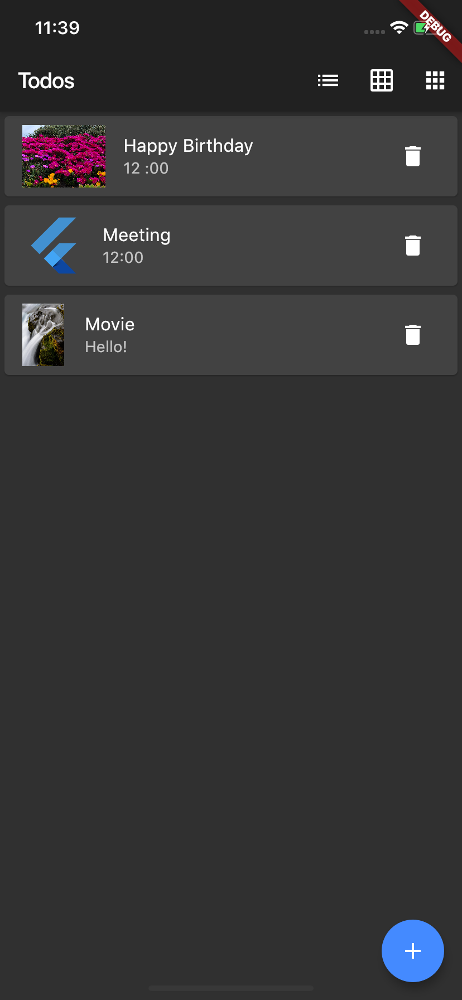|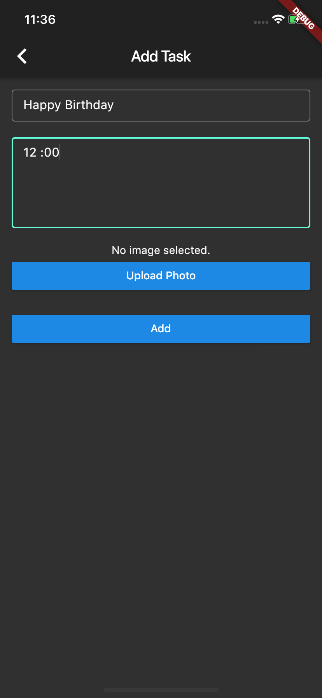 | 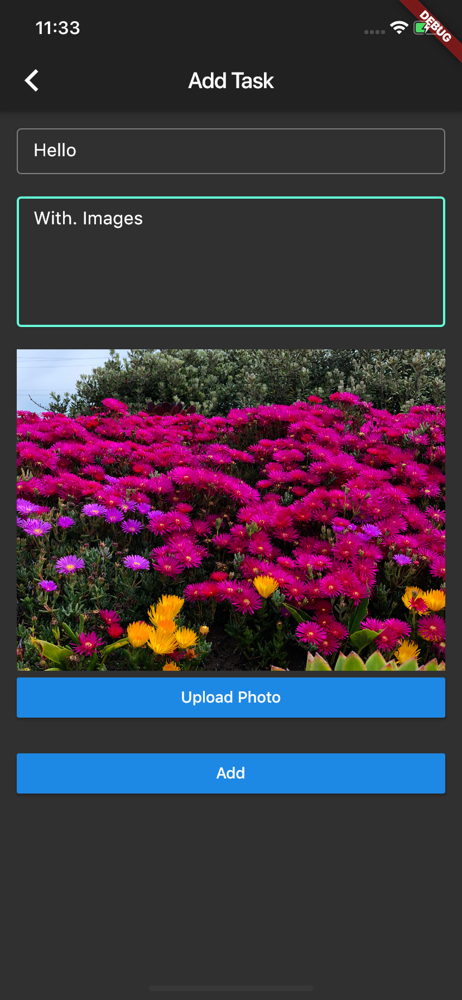
|  | 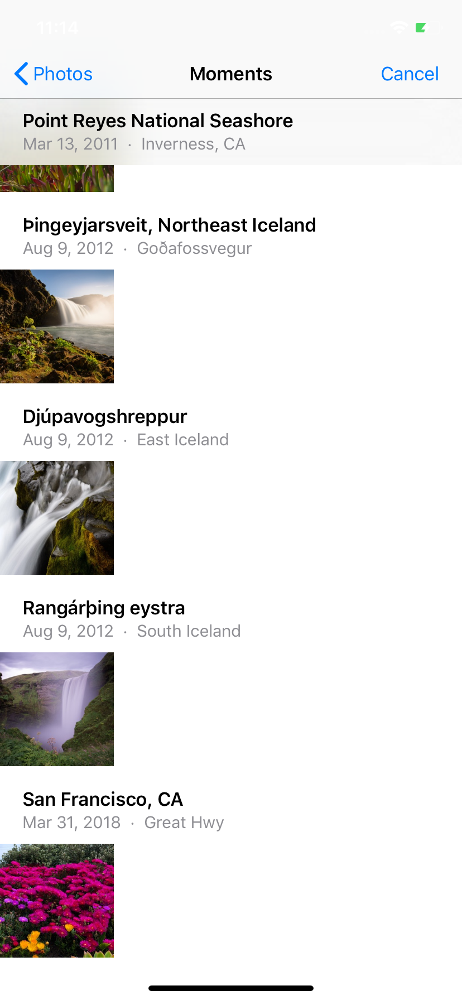| |
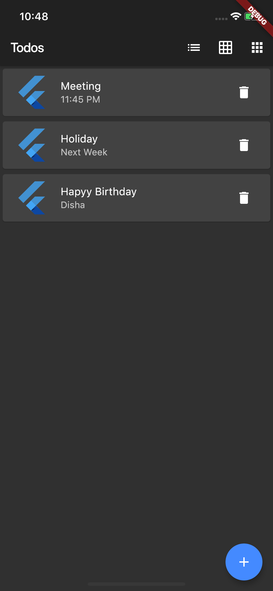| 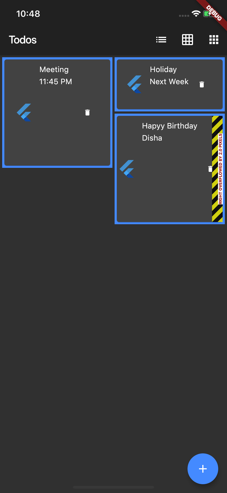| 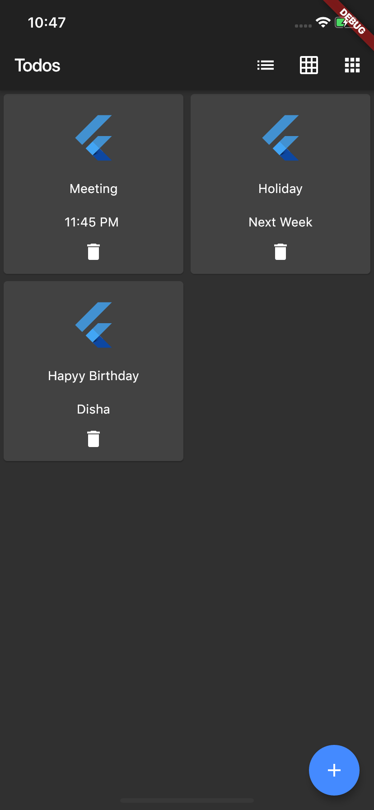|
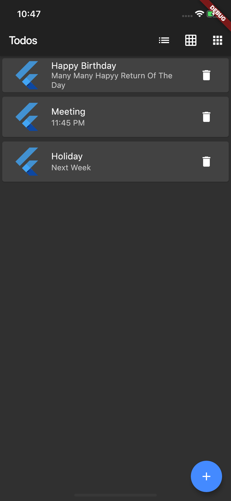| 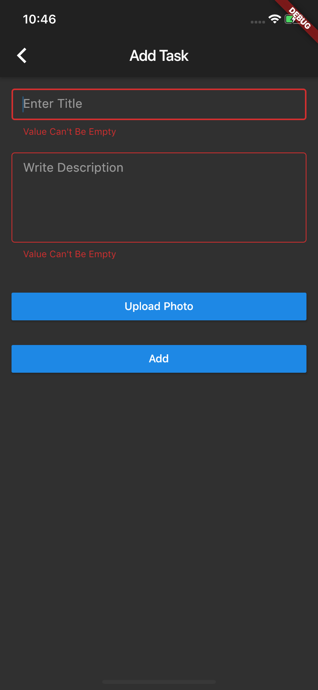| 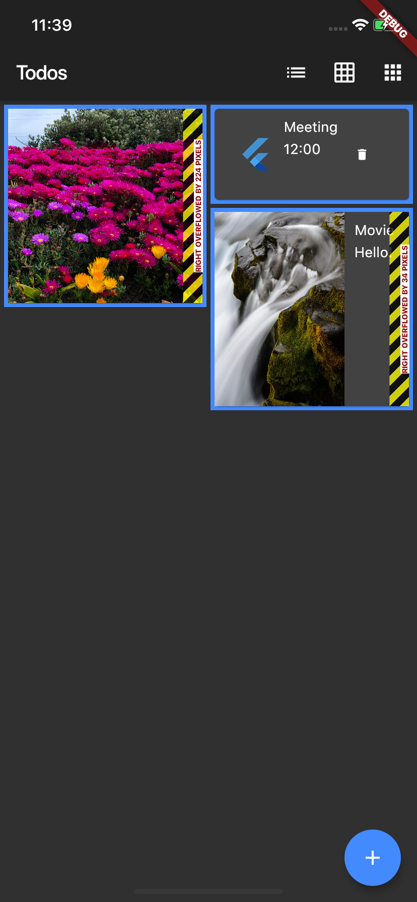|


# Android

|                                                                                                                             |                                                                                                                               |                                                                                                                                                                                                                                                                                                                                                                   |
|-----------------------------------------------------------------------------------------------------------------------------|-------------------------------------------------------------------------------------------------------------------------------|-------------------------------------------------------------------------------------------------------------------------------------------------------------------------------------------------------------------------------------------------------------------------------------------------------------------------------------------------------------------------
| 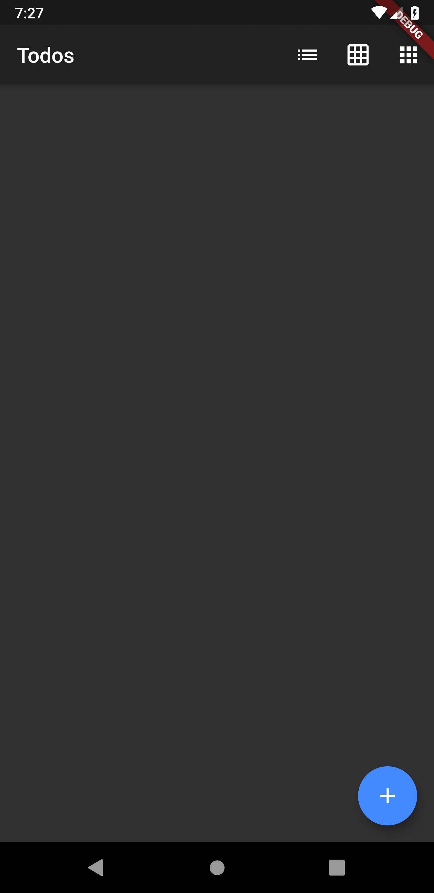| | | 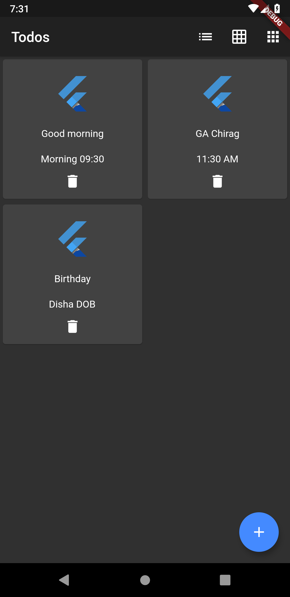| 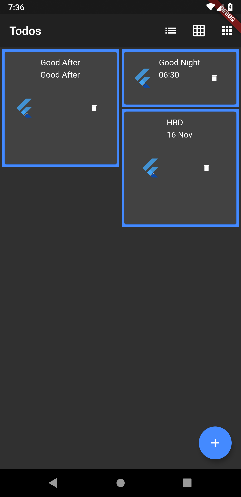|
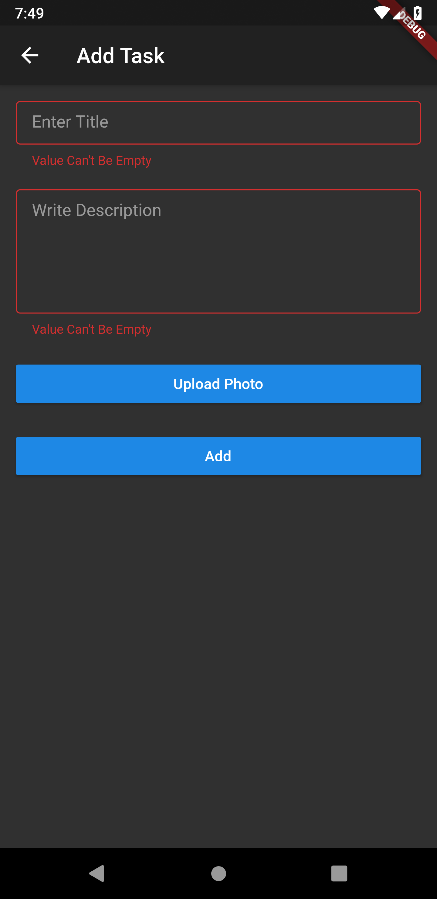| | 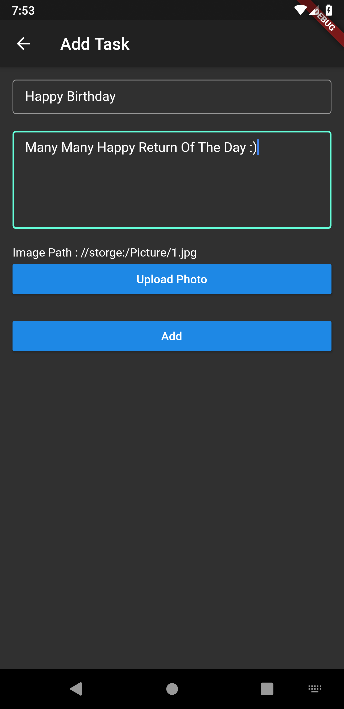| 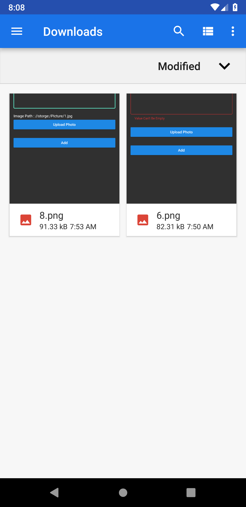


## License
Copyright 2019 Jadav Chirag

Licensed under the Apache License, Version 2.0 (the "License"); you may not use this file except in compliance with the License. You may obtain a copy of the License at

http://www.apache.org/licenses/LICENSE-2.0

Unless required by applicable law or agreed to in writing, software distributed under the License is distributed on an "AS IS" BASIS, WITHOUT WARRANTIES OR CONDITIONS OF ANY KIND, either express or implied. See the License for the specific language governing permissions and limitations under the License.
